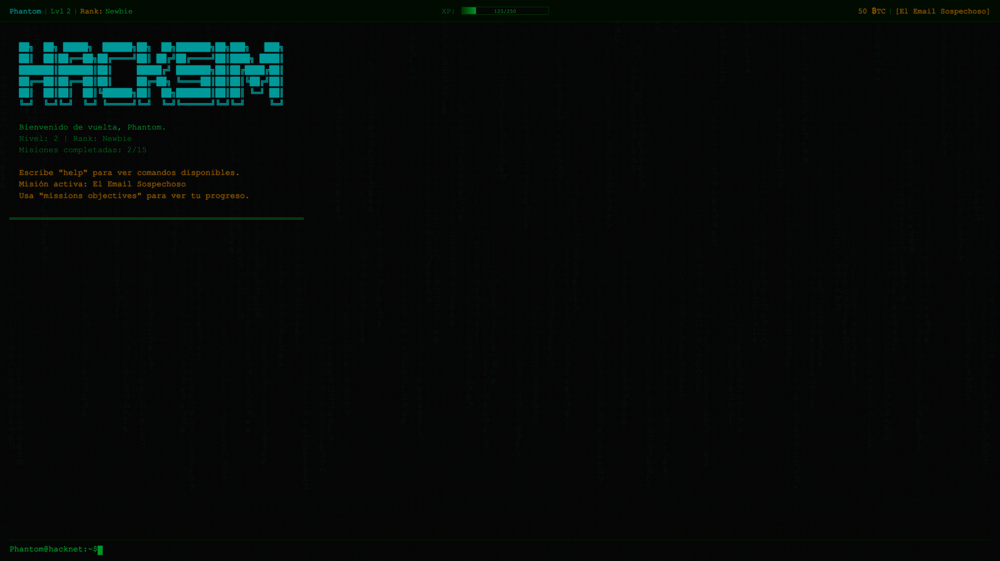

# HackSim 🖥️💀

**Simulador de Hacker educativo sobre ciberseguridad.** Aprendé conceptos reales de seguridad informática jugando en una terminal retro estilo hacker de película.



## Sobre el Juego

HackSim es un juego de simulación donde asumís el rol de un hacker ético. Usás comandos de terminal para escanear redes, explotar vulnerabilidades, descifrar archivos y completar misiones — todo mientras aprendés sobre ciberseguridad real.

### Características

- 🖥️ **Terminal retro** con efecto CRT, scanlines y lluvia de caracteres estilo Matrix
- 🎯 **15 misiones** progresivas de dificultad creciente
- 🛒 **Tienda** de herramientas de hacking (PortScanner, PassCracker, ExploitKit, etc.)
- 🏆 **Sistema de logros** y rangos (Newbie → Elite → Phantom)
- 📈 **Progresión RPG** con XP, niveles y BTC como moneda
- 🔊 **Sonido sintetizado** con Web Audio API
- 💾 **Guardado automático** en localStorage
- 👦👧 **Modo Niños** (7-10 años) con explicaciones simplificadas y aventuras

### Temas de Ciberseguridad Cubiertos

| Misión | Tema |
|--------|------|
| Tutorial | Navegación de sistemas de archivos |
| Servidor Vulnerable | Reconocimiento y escaneo de puertos |
| Fuerza Bruta | Cracking de contraseñas y autenticación |
| Email Sospechoso | Phishing y ingeniería social |
| SQL Injection | Inyección SQL y sanitización de inputs |
| Servidor Desactualizado | Gestión de parches y actualizaciones |
| Comunicaciones Cifradas | Criptografía y cifrado |
| Insider Threat | Amenazas internas y monitoreo |
| Firewall Bypass | Firewalls y seguridad perimetral |
| Escalación de Privilegios | Privilege escalation y control de acceso |
| Man-in-the-Middle | Ataques MITM y VPN |
| Red Corporativa | Seguridad de redes empresariales |
| Zero-Day | Vulnerabilidades zero-day |
| Ransomware | Ransomware y respuesta a incidentes |
| Misión Final | Operación completa de red team |

## Cómo Jugar

### Opción 1: En el navegador

Abrí `index.html` directamente en tu navegador, o usá un servidor local:

```bash
# Con Python
python3 -m http.server 9999
# Abrí http://localhost:9999

# Con Node.js
npx serve -p 9999
```

### Opción 2: App de escritorio (Electron)

```bash
# Instalá dependencias
npm install

# Ejecutá la app
npm start
```

### Opción 3: Buildear instalador

```bash
# macOS (.dmg)
npm run build

# Windows (.exe)
npm run build:win

# Linux (.AppImage)
npm run build:linux
```

El instalador se genera en la carpeta `dist/`.

## Comandos Principales

```
help              → Ver todos los comandos
missions          → Lista de misiones disponibles
missions accept 1 → Aceptar una misión
status            → Tu perfil de hacker
shop              → Tienda de herramientas
scan <ip>         → Escanear puertos de un servidor
connect <ip>      → Conectar a un servidor
ls / cd / cat     → Navegar el filesystem remoto
crack <ip>        → Crackear contraseñas
exploit <ip>      → Explotar vulnerabilidades
kids              → Activar/desactivar modo niños
explain <cmd>     → Explicación simplificada (modo niños)
```

## Modo Niños 👦👧

Para jugadores de 7-10 años. Activalo escribiendo `kids` en la terminal:

- Los comandos se explican con analogías del mundo real
- Cada misión tiene una historia de aventuras (ej: "¡Cuidado con los Emails Trampa!")
- Las lecciones de ciberseguridad se simplifican para niños
- Usá `explain scan` para aprender qué hace cada comando

## Stack Técnico

- **HTML5 / CSS3 / JavaScript** vanilla — sin frameworks
- **Patrón IIFE** para módulos (Terminal, GameState, Commands, etc.)
- **CSS Variables** para theming retro (glow, scanlines, CRT)
- **Web Audio API** para sonidos sintetizados
- **localStorage** para persistencia del estado
- **Electron** para versión desktop

## Estructura del Proyecto

```
hacksim/
├── index.html          # Página principal
├── css/
│   └── style.css       # Estilos retro/CRT
├── js/
│   ├── main.js         # Bootstrap e inicialización
│   ├── terminal.js     # Emulador de terminal
│   ├── commands.js     # Sistema de comandos
│   ├── gameState.js    # Estado del juego y persistencia
│   ├── missions.js     # 15 misiones con red simulada
│   ├── network.js      # Simulación de red/servidores
│   ├── shop.js         # Tienda de herramientas
│   ├── achievements.js # Sistema de logros
│   ├── sound.js        # Audio sintetizado
│   └── ui.js           # HUD y efectos visuales
├── electron-main.js    # Entry point Electron
├── package.json        # Dependencias y scripts
└── screenshots/
    └── gameplay.png
```

## Licencia

[GPL-3.0](LICENSE)

---

Cocreado por **Ezequiel Lamonica** y **[Claude Code](https://claude.ai/claude-code)** para **Tobías** (7 años), que quiere aprender sobre ciberseguridad. 💚🧒💻
